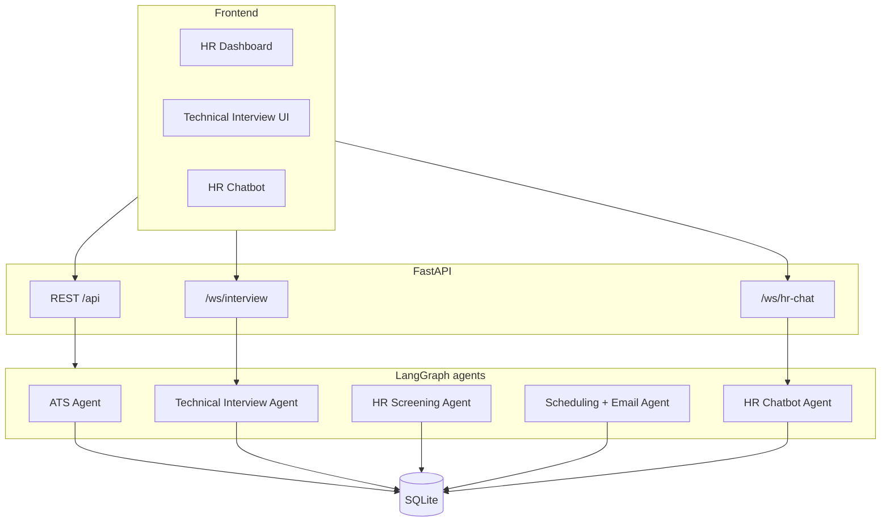

# HR Recruitment Agent System

End-to-end recruitment pipeline for **Skysecure Technologies**–style submissions: **LangGraph** agents, **FastAPI** API + **WebSockets**, React dashboard, SQLite persistence, optional **OpenAI** calls, and a small **MCP** stdio server (bonus).

## Architecture



### Technology choices

| Area | Choice | Why |
|------|--------|-----|
| Orchestration | **LangGraph** | Required; each module is a stateful graph with explicit nodes/edges. |
| API | **FastAPI** | Required; async routes, OpenAPI, WebSocket support. |
| DB | **SQLite** + SQLAlchemy 2 async | Simple demo deploy; swap `DATABASE_URL` for PostgreSQL if needed. |
| LLM | **OpenAI** (optional) | `MOCK_LLM=true` works without a key for local demos. |
| Email | **aiosmtplib** + log dedup | `MOCK_EMAIL=true` skips SMTP and only logs. |
| Frontend | **React + Vite** | Fast dev UX; proxies to API in `vite.config.ts`. |
| RAG | Embeddings + chunk similarity (ATS + chatbot context) | Meets RAG requirement without a separate vector DB. |
| Bonus MCP | `mcp_server/hr_recruitment_mcp.py` | Stdio JSON-RPC tools over the same SQLite file. |

## Setup

### Backend

```bash
cd backend
python3 -m venv .venv
source .venv/bin/activate   # Windows: .venv\Scripts\activate
pip install -r requirements.txt
cp .env.example .env        # add OPENAI_API_KEY for real LLM / embeddings
uvicorn hr_agent.api.main:app --reload --host 0.0.0.0 --port 8000
```

### Frontend

```bash
cd frontend
npm install
npm run dev
```

Open `http://localhost:5173`. API is proxied to `http://127.0.0.1:8000`.

### MCP (bonus)

With the API having created `backend/hr_agent.db`:

```bash
python3 mcp_server/hr_recruitment_mcp.py
```

Point your MCP client at this stdio command. Optional DB path: `python3 mcp_server/hr_recruitment_mcp.py /path/to/hr_agent.db`.

## Pipeline stages

1. **applied** — resume uploaded.  
2. **ATS** — RAG + LLM score; **≥ 80** → `technical_interview`; else `ats_rejected` + email.  
3. **technical_interview** — timed answers (30s, enforced server-side on WebSocket), LLM scoring.  
4. **hr_screening** — questions from resume (no duplicate facts), logistics + education.  
5. **scheduling** — availability, meeting link, emails to candidate + HR (deduped log).  
6. **interview_scheduled** — confirmed.

## API highlights

- `POST /api/roles` — create role (JD + headcount).  
- `POST /api/candidates/upload` — multipart resume → ATS graph.  
- `POST /api/candidates/{id}/technical/start` — begin technical session.  
- WebSocket `/ws/interview` — `start` / `answer` messages.  
- `POST /api/candidates/{id}/screening/start|submit`  
- `POST /api/candidates/{id}/schedule`  
- `GET /api/dashboard/summary` — filters `role_id`, `stage`.  
- WebSocket `/ws/hr-chat` — grounded chatbot (DB + RAG snippets).

## Live demo

Deploy backend (e.g. Railway/Render/Fly) with `CORS_ORIGINS` set to your frontend URL; build frontend with `VITE_API_BASE` if you add it, or same-origin behind a reverse proxy.

## License

Demo project (2026).
